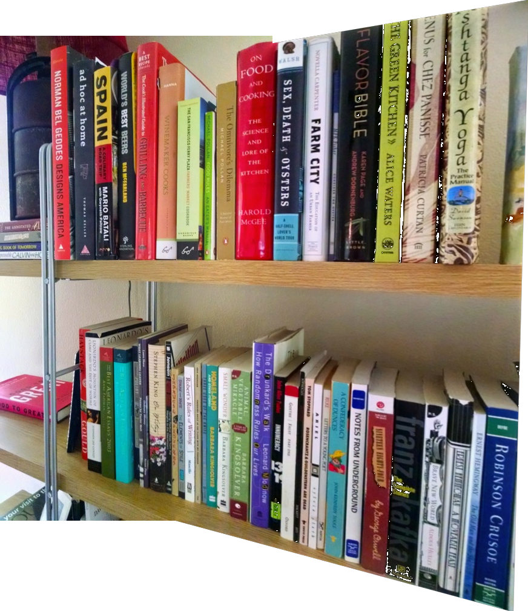

# Description
Image stitching is the process of combining multiple images with overlapping fields to produce a composite image that has a wider field of view than a single image. It is used in a variety of fields, such as satellite imaging and medical imaging. This project provides an easy way of stitching a sequence of ordered images and seamlessly blending them. OpenCV is utilized in this project, but none of the functions from the stitcher class were used.



# Features  
**Homography Fitting:**  
* Features matched using SIFT are run through a ratio test to eliminate ambiguous matches  
* Homographies are estimated using RANSAC algorithm for invariance to outliers  

**Image Warping + Mosiacing:**
* Uses a running panorama and iteratively builds it with each image in order

**Blending**
* Laplacian pyramid blending merges images frequency-band by frequency-band, eliminating the hard seams a flat crossfade would leave behind

**Front end**
* Streamlit is used for the browser interface. Images are uploaded and assigned an order and the final image can be downloaded as a PNG.

## Using the app:
The app is hosted on Streamlit Community:  
> https://panorama-stitcher-abnyyzzhu4zj5bottyv6en.streamlit.app/  

**Running the code locally:**

Use the following command in a terminal to clone the repo:  
```
git clone https://github.com/zjlukan/Facial-Tracking-and-Emotion-Recognition-Using-Neural-Networks
```
Go into the directory then run the following command:  
```
pip install -r requirements.txt
```
To run the pano-core program locally, use the following command:  
```
python3 ./main.py [--show] [image 1 path] [image 2 path] ... [image n path]
```

example:  

> python .\pano_stitcher.py --show image1.png image2.png image3.png  

**Show steps:**  
Optional argument that will create a visual for every step in the pano-stitching process if enabled  

To run the front end locally using localhost, run the following command:  
```
streamlit run app.py
```
